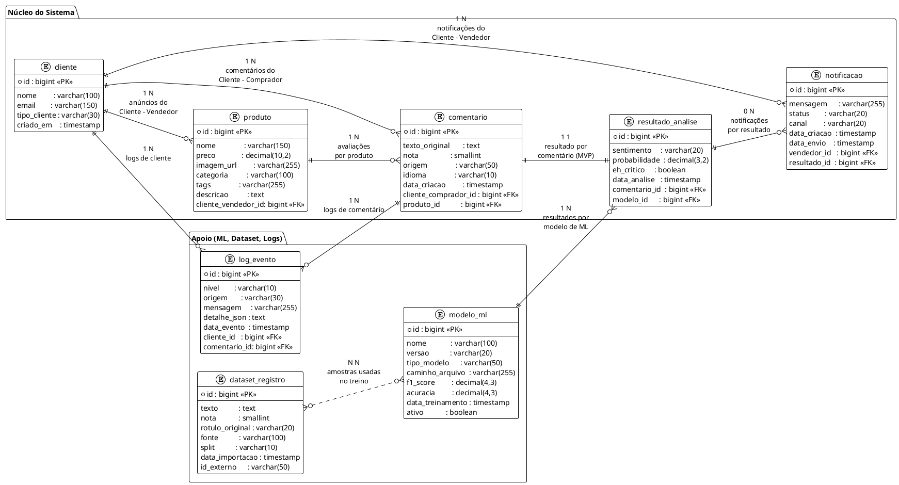

# Banco de Dados
**Projeto:** Hackathon One Sentiment API  
**Versão do documento:** 1.0  
**Data:** 28/12/2025

---

## 1. Visão geral

O objetivo deste documento é descrever o **modelo de dados** do projeto **Hackathon One Sentiment API**, cobrindo:

- escolha de banco e ambiente;
- convenções de nomenclatura;
- descrição das tabelas e relacionamentos;
- alinhamento com o domínio (entidades Java);
- fluxos principais que afetam o banco (comentário, análise, notificação, dashboard);
- pontos de atenção para testes, segurança e evolução futura.

Toda a parte de banco foi pensada para:

- ser fácil de integrar com **Spring Boot + JPA**;
- suportar a análise de sentimentos acoplada ao modelo de ML;
- permitir consultas úteis para o dashboard do Vendedor;
- registrar logs e metadados de ML de forma organizada.

---

## 2. Banco de dados e ambiente

### 2.1. Tecnologia

- **SGBD**: PostgreSQL
- **Versão alvo**: qualquer 13+ (desenvolvimento em local/contêiner).
- **Nome do banco (sugestão)**: `sentimentdb`

### 2.2. Localização dos artefatos

- DDL (schema completo):  
  `ddl/schema-postgres.sql`
- Diagramas ER (PlantUML):  
  `docs/uml/02-diagrama-de-er-banco.puml`

### 2.3. Integração com Spring Boot

Configuração típica em `application-dev.yml`:

```yaml
spring:
  datasource:
    url: jdbc:postgresql://localhost:5432/sentimentdb
    username: sentiment_user
    password: sentiment_pass
  jpa:
    hibernate:
      ddl-auto: validate   # ou none, dependendo da estratégia
    show-sql: true
    properties:
      hibernate.format_sql: true
```

> A recomendação é usar **`ddl-auto: validate`** ou **`none`** em produção, e rodar o `schema-postgres.sql` manualmente ou via migration (Flyway/Liquibase).

---

## 3. Convenções de modelagem

### 3.1. Padrões gerais

* **Nomes de tabelas**: `snake_case`, em minúsculas (ex.: `cliente`, `resultado_analise`).
* **Chaves primárias**: `id BIGSERIAL PRIMARY KEY` (PostgreSQL).
* **Chaves estrangeiras**: `nome_tabela_id` (ex.: `cliente_vendedor_id` em `produto`).
* **Constraints nomeadas**:
  `pk_*`, `fk_*`, `uq_*`, `ck_*` (constraints de tipo `PRIMARY KEY`, `FOREIGN KEY`, `UNIQUE`, `CHECK`).
* **Tipos numéricos e decimais**:

    * `NUMERIC(10,2)` para valores monetários (ex.: preço);
    * `NUMERIC(3,2)` para probabilidades (`0.00` a `1.00`);
    * `NUMERIC(4,3)` para métricas de modelo (ex.: F1).
* **Datas**: `TIMESTAMP` com timezone default do servidor.
* **Booleans**: `BOOLEAN` com `DEFAULT` quando fizer sentido.

### 3.2. Alinhamento com o domínio Java

Em Java, as entidades seguem nomes em PascalCase:

| Tabela SQL          | Entidade Java      |
| ------------------- | ------------------ |
| `cliente`           | `Cliente`          |
| `produto`           | `Produto`          |
| `comentario`        | `Comentario`       |
| `modelo_ml`         | `ModeloML`         |
| `resultado_analise` | `ResultadoAnalise` |
| `notificacao`       | `Notificacao`      |
| `dataset_registro`  | `DatasetRegistro`  |
| `log_evento`        | `LogEvento`        |

Enums (exemplo):

* `TipoCliente` (`CLIENTE_COMPRADOR`, `CLIENTE_VENDEDOR`, `ADMIN`)
* `Sentimento` (`POSITIVO`, `NEGATIVO`, `NEUTRO`)
* `StatusNotificacao` (`PENDENTE`, `ENVIADA`, `LIDA`)
* `CanalNotificacao` (`DASHBOARD`, `EMAIL`)
* `NivelLog` (`INFO`, `WARN`, `ERROR`)
* `SplitDataset` (`TRAIN`, `TEST`, `VALID`)

---

## 4. Tabelas do núcleo

### 4.1. Tabela `cliente`

Representa qualquer cliente do sistema:

* **Cliente - Comprador**
* **Cliente - Vendedor**
* **Admin**

```sql
CREATE TABLE cliente (
    id            BIGSERIAL PRIMARY KEY,
    nome          VARCHAR(100) NOT NULL,
    email         VARCHAR(150),
    tipo_cliente  VARCHAR(30)  NOT NULL, -- CLIENTE_COMPRADOR / CLIENTE_VENDEDOR / ADMIN
    criado_em     TIMESTAMP    NOT NULL DEFAULT CURRENT_TIMESTAMP,

    CONSTRAINT uq_cliente_email UNIQUE (email),
    CONSTRAINT ck_cliente_tipo_cliente
        CHECK (tipo_cliente IN ('CLIENTE_COMPRADOR', 'CLIENTE_VENDEDOR', 'ADMIN'))
);
```

**Campo-chave de negócio**:

* `email` pode ser usado como identificador lógico (quando existir).

**Observações**:

* A mesma tabela serve tanto para Comprador quanto para Vendedor, diferenciados por `tipo_cliente`.
* Possível evolução: colunas específicas de perfil (ex.: CPF/CNPJ, telefone, etc.).

---

### 4.2. Tabela `produto`

Anúncios criados pelo **Cliente - Vendedor**.

```sql
CREATE TABLE produto (
    id                   BIGSERIAL PRIMARY KEY,
    nome                 VARCHAR(150) NOT NULL,
    preco                NUMERIC(10,2) NOT NULL,
    imagem_url           VARCHAR(255),
    categoria            VARCHAR(100),
    tags                 VARCHAR(255),   -- tags separadas por vírgula
    descricao            TEXT,
    cliente_vendedor_id  BIGINT NOT NULL, -- dono do anúncio (Cliente - Vendedor)

    CONSTRAINT fk_produto_cliente_vendedor
        FOREIGN KEY (cliente_vendedor_id) REFERENCES cliente(id)
            ON DELETE CASCADE
);

CREATE INDEX idx_produto_cliente_vendedor
    ON produto (cliente_vendedor_id);
```

**Regras de negócio**:

* Apenas clientes com `tipo_cliente = 'CLIENTE_VENDEDOR'` devem ser usados como `cliente_vendedor_id`.
* Ao deletar um vendedor, seus produtos são deletados em cascata (`ON DELETE CASCADE`).

---

### 4.3. Tabela `comentario`

Avaliações feitas por **Cliente - Comprador** sobre um `produto`.

```sql
CREATE TABLE comentario (
    id                    BIGSERIAL PRIMARY KEY,
    texto_original        TEXT        NOT NULL,
    nota                  SMALLINT,              -- 1 a 5
    origem                VARCHAR(50),           -- SITE / APP / OUTRO
    idioma                VARCHAR(10) DEFAULT 'pt-BR',
    data_criacao          TIMESTAMP   NOT NULL DEFAULT CURRENT_TIMESTAMP,
    cliente_comprador_id  BIGINT,
    produto_id            BIGINT      NOT NULL,

    CONSTRAINT fk_comentario_cliente_comprador
        FOREIGN KEY (cliente_comprador_id) REFERENCES cliente(id)
            ON DELETE SET NULL,
    CONSTRAINT fk_comentario_produto
        FOREIGN KEY (produto_id) REFERENCES produto(id)
            ON DELETE CASCADE,
    CONSTRAINT ck_comentario_nota
        CHECK (nota IS NULL OR (nota >= 1 AND nota <= 5))
);

CREATE INDEX idx_comentario_data_criacao
    ON comentario (data_criacao);

CREATE INDEX idx_comentario_cliente_comprador
    ON comentario (cliente_comprador_id);

CREATE INDEX idx_comentario_produto
    ON comentario (produto_id);
```

**Pontos importantes**:

* `nota` é opcional (pode ser apenas um comentário textual).
* `origem` permite diferenciar canal (site, app, marketplace, etc.).
* A relação com `cliente_comprador_id` é **fraca** (SET NULL caso o cliente seja removido, preservando o histórico de comentários).

---

### 4.4. Tabela `modelo_ml`

Metadados do modelo de Machine Learning usado para classificar o sentimento.

```sql
CREATE TABLE modelo_ml (
    id               BIGSERIAL PRIMARY KEY,
    nome             VARCHAR(100) NOT NULL,  -- ex.: sentiment-logreg-tfidf
    versao           VARCHAR(20)  NOT NULL,  -- ex.: v1
    tipo_modelo      VARCHAR(50)  NOT NULL,  -- ex.: LogisticRegression
    caminho_arquivo  VARCHAR(255) NOT NULL,  -- caminho do .pkl
    f1_score         NUMERIC(4,3),
    acuracia         NUMERIC(4,3),
    data_treinamento TIMESTAMP,
    ativo            BOOLEAN      NOT NULL DEFAULT FALSE,

    CONSTRAINT uq_modelo_nome_versao UNIQUE (nome, versao)
);
```

**Uso prático**:

* Permite rastrear qual modelo foi usado para qual previsão.
* Campo `ativo` pode ser usado para indicar o modelo padrão.
* Informações alimentadas pela equipe de DS ou por scripts no deploy.

---

### 4.5. Tabela `resultado_analise`

Resultado de análise de sentimento para um `comentario`.

```sql
CREATE TABLE resultado_analise (
    id            BIGSERIAL PRIMARY KEY,
    sentimento    VARCHAR(20)  NOT NULL,           -- POSITIVO / NEGATIVO / NEUTRO
    probabilidade NUMERIC(3,2) NOT NULL,           -- 0.00 a 1.00
    eh_critico    BOOLEAN      NOT NULL DEFAULT FALSE,
    data_analise  TIMESTAMP    NOT NULL DEFAULT CURRENT_TIMESTAMP,

    comentario_id BIGINT       NOT NULL,
    modelo_id     BIGINT,

    CONSTRAINT fk_resultado_comentario
        FOREIGN KEY (comentario_id) REFERENCES comentario(id)
            ON DELETE CASCADE,
    CONSTRAINT fk_resultado_modelo
        FOREIGN KEY (modelo_id) REFERENCES modelo_ml(id)
            ON DELETE SET NULL,
    CONSTRAINT ck_resultado_sentimento
        CHECK (sentimento IN ('POSITIVO', 'NEGATIVO', 'NEUTRO')),
    CONSTRAINT ck_resultado_probabilidade
        CHECK (probabilidade >= 0.0 AND probabilidade <= 1.0)
);

CREATE INDEX idx_resultado_sentimento
    ON resultado_analise (sentimento);

CREATE INDEX idx_resultado_eh_critico
    ON resultado_analise (eh_critico);

CREATE INDEX idx_resultado_data_analise
    ON resultado_analise (data_analise);

CREATE INDEX idx_resultado_comentario
    ON resultado_analise (comentario_id);
```

**Regra de cardinalidade (MVP)**:

* Um comentário tem **exatamente um** resultado de análise.
  Futuramente pode ser ampliado para 1:N se quiser reprocessar o mesmo comentário com vários modelos.

**Campo `eh_critico`**:

* Indica se o comentário deve ser tratado como prioritário para alertas (notificações, e-mail, etc.).
* Recomendação de regra de negócio: `eh_critico = TRUE` quando:

    * `sentimento = 'NEGATIVO'` e
    * `probabilidade` acima de um certo limiar (ex.: 0.8).

---

### 4.6. Tabela `notificacao`

Notificações associadas a resultados críticos, destinadas ao **Cliente - Vendedor**.

```sql
CREATE TABLE notificacao (
    id           BIGSERIAL PRIMARY KEY,
    mensagem     VARCHAR(255) NOT NULL,
    status       VARCHAR(20)  NOT NULL DEFAULT 'PENDENTE',   -- PENDENTE / ENVIADA / LIDA
    canal        VARCHAR(20)  NOT NULL DEFAULT 'DASHBOARD',  -- DASHBOARD / EMAIL
    data_criacao TIMESTAMP    NOT NULL DEFAULT CURRENT_TIMESTAMP,
    data_envio   TIMESTAMP,

    vendedor_id  BIGINT       NOT NULL,   -- Cliente - Vendedor
    resultado_id BIGINT       NOT NULL,   -- resultado_analise associado

    CONSTRAINT fk_notif_vendedor
        FOREIGN KEY (vendedor_id) REFERENCES cliente(id)
            ON DELETE CASCADE,
    CONSTRAINT fk_notif_resultado
        FOREIGN KEY (resultado_id) REFERENCES resultado_analise(id)
            ON DELETE CASCADE,
    CONSTRAINT ck_notif_status
        CHECK (status IN ('PENDENTE', 'ENVIADA', 'LIDA')),
    CONSTRAINT ck_notif_canal
        CHECK (canal IN ('DASHBOARD', 'EMAIL'))
);

CREATE INDEX idx_notif_status
    ON notificacao (status);

CREATE INDEX idx_notif_vendedor
    ON notificacao (vendedor_id);
```

**Regras de negócio-chave**:

* Notificações são criadas apenas quando:

    * `resultado_analise.sentimento = 'NEGATIVO'` e
    * `eh_critico = TRUE`.
* Vendedor altera `status` para `LIDA` via endpoint específico (`PATCH /api/v1/notificacoes/{id}/ler`).
* `canal = 'DASHBOARD'` indica notificação só visual na UI; `EMAIL` pode indicar envio externo.

---

## 5. Tabelas de apoio (ML, Dataset, Logs)

### 5.1. Tabela `dataset_registro`

Registra amostras do dataset de treino/validação/teste.

```sql
CREATE TABLE dataset_registro (
    id              BIGSERIAL PRIMARY KEY,
    texto           TEXT         NOT NULL,
    nota            SMALLINT,
    rotulo_original VARCHAR(20)  NOT NULL,  -- POS / NEG / NEU
    fonte           VARCHAR(100) NOT NULL,  -- ex.: Kaggle
    split           VARCHAR(10)  NOT NULL,  -- TRAIN / TEST / VALID
    data_importacao TIMESTAMP    NOT NULL DEFAULT CURRENT_TIMESTAMP,
    id_externo      VARCHAR(50),

    CONSTRAINT ck_dataset_split
        CHECK (split IN ('TRAIN', 'TEST', 'VALID')),
    CONSTRAINT ck_dataset_nota
        CHECK (nota IS NULL OR (nota >= 1 AND nota <= 5))
);

CREATE INDEX idx_dataset_split
    ON dataset_registro (split);

CREATE INDEX idx_dataset_rotulo
    ON dataset_registro (rotulo_original);
```

**Usos práticos**:

* Guardar amostras do dataset para auditoria e rastreio de desempenho;
* Em uma evolução, relacionar `dataset_registro` com `modelo_ml` (ex.: quais amostras foram usadas naquele treino).

---

### 5.2. Tabela `log_evento`

Registro de eventos importantes da aplicação: erros, avisos, acessos de dashboard, etc.

```sql
CREATE TABLE log_evento (
    id            BIGSERIAL PRIMARY KEY,
    nivel         VARCHAR(10)   NOT NULL,   -- INFO / WARN / ERROR
    origem        VARCHAR(30)   NOT NULL,   -- API / ML_SERVICE / FRONTEND / DB
    mensagem      VARCHAR(255)  NOT NULL,
    detalhe_json  TEXT,
    data_evento   TIMESTAMP     NOT NULL DEFAULT CURRENT_TIMESTAMP,
    cliente_id    BIGINT,
    comentario_id BIGINT,

    CONSTRAINT fk_log_cliente
        FOREIGN KEY (cliente_id) REFERENCES cliente(id)
            ON DELETE SET NULL,
    CONSTRAINT fk_log_comentario
        FOREIGN KEY (comentario_id) REFERENCES comentario(id)
            ON DELETE SET NULL,
    CONSTRAINT ck_log_nivel
        CHECK (nivel IN ('INFO', 'WARN', 'ERROR'))
);

CREATE INDEX idx_log_nivel
    ON log_evento (nivel);

CREATE INDEX idx_log_origem
    ON log_evento (origem);

CREATE INDEX idx_log_data_evento
    ON log_evento (data_evento);
```

**Boas práticas**:

* Centralizar os registros de log via um serviço/helper de log no backend;
* Usar `detalhe_json` para payloads extras (ID de notificação, stacktrace simplificado, contexto da requisição, etc.);
* `cliente_id` e `comentario_id` ajudam a rastrear problemas específicos.

---

## 6. Relacionamentos (ER)

### 6.1. Diagrama ER em PlantUML

Arquivo: `docs/uml/02-diagrama-de-er-banco.puml`

Trecho simplificado:



---

## 7. Fluxos que impactam o banco

### 7.1. Novo comentário + análise + notificação

Fluxo detalhado no diagrama:

* `docs/uml/10-diagrama-de-fluxo-no-banco-comentario-analise-notificacao.puml`

Resumo:

1. Frontend (Comprador) envia `POST /api/v1/comentarios` com texto/nota/produto.
2. Backend valida e:

    * insere `comentario`;
    * loga em `log_evento`.
3. Backend chama ML (`POST /predict`) e recebe `label` + `probability`.
4. Backend:

    * insere `resultado_analise` com `sentimento`, `probabilidade`, `eh_critico`;
    * loga o resultado.
5. Se `NEGATIVO` e crítico:

    * descobre `vendedor_id` via `produto`;
    * insere `notificacao`;
    * registra logs extras (dashboard + e-mail/SMS, se aplicável).

### 7.2. Dashboard do Vendedor, leitura de notificações e export

Fluxo detalhado no diagrama:

* `docs/uml/11-diagrama-de-fluxo-no-banco-dashboard-notificacoes-export.puml`

Resumo:

1. Vendedor acessa dashboard:

    * backend consulta `produto`, `comentario`, `resultado_analise`, `notificacao`;
    * calcula stats e monta JSON.
2. Vendedor marca notificação como lida:

    * `UPDATE notificacao SET status = 'LIDA', data_envio = now()`;
    * loga ação em `log_evento`.
3. Vendedor exporta JSON:

    * backend junta dados de `cliente` (compradores), `produto`, `comentario`, `resultado_analise`;
    * retorna JSON exportável;
    * registra `log_evento`.

---

## 8. Testes de banco (manual/inicial)

Alguns testes manuais úteis no PostgreSQL:

1. **Criar um Cliente vendedor**:

```sql
INSERT INTO cliente (nome, email, tipo_cliente)
VALUES ('Loja Exemplo', 'contato@loja.com', 'CLIENTE_VENDEDOR')
RETURNING id;
```

2. **Criar um Produto para esse vendedor**:

```sql
INSERT INTO produto (nome, preco, imagem_url, categoria, tags, descricao, cliente_vendedor_id)
VALUES ('Fone Bluetooth', 199.90, NULL, 'Eletrônicos', 'Bluetooth,Sem Fio', 'Fone leve e confortável...', 1)
RETURNING id;
```

3. **Criar um Cliente comprador**:

```sql
INSERT INTO cliente (nome, email, tipo_cliente)
VALUES ('Maria Compradora', 'maria@exemplo.com', 'CLIENTE_COMPRADOR')
RETURNING id;
```

4. **Salvar um Comentário**:

```sql
INSERT INTO comentario (texto_original, nota, origem, idioma, cliente_comprador_id, produto_id)
VALUES ('Não gostei, veio com defeito.', 1, 'SITE', 'pt-BR', 2, 1)
RETURNING id;
```

5. **Simular um Resultado de análise NEGATIVO e crítico**:

```sql
INSERT INTO modelo_ml (nome, versao, tipo_modelo, caminho_arquivo, f1_score, acuracia, data_treinamento, ativo)
VALUES ('sentiment-logreg-tfidf', 'v1', 'LogisticRegression', '/model/sentiment_model.pkl', 0.900, 0.920, NOW(), TRUE)
RETURNING id;

INSERT INTO resultado_analise (sentimento, probabilidade, eh_critico, comentario_id, modelo_id)
VALUES ('NEGATIVO', 0.92, TRUE, 1, 1)
RETURNING id;
```

6. **Criar Notificação ligada ao resultado**:

```sql
INSERT INTO notificacao (mensagem, status, canal, vendedor_id, resultado_id)
VALUES ('Comentário crítico detectado para o seu produto.', 'PENDENTE', 'DASHBOARD', 1, 1);
```

7. **Ver comentários, resultados e notificações em conjunto**:

```sql
SELECT
  c.id AS comentario_id,
  c.texto_original,
  r.sentimento,
  r.probabilidade,
  n.status AS status_notificacao
FROM comentario c
JOIN resultado_analise r ON r.comentario_id = c.id
LEFT JOIN notificacao n ON n.resultado_id = r.id;
```

---

## 9. Evolução futura

Algumas evoluções possíveis mantendo a estrutura:

* Adicionar tabela `usuario` separada de `cliente`, se for necessário um sistema de autenticação mais complexo.
* Adicionar campos de **perfil do comprador** (idade, gênero, número de compras) para análises mais ricas no dashboard.
* Tornar a relação `comentario` ↔ `resultado_analise` em 1:N (permitindo reprocessamento com novos modelos).
* Criar índices adicionais conforme consultas reais do dashboard.
* Implementar **migrations automáticas** com Flyway ou Liquibase a partir de `schema-postgres.sql`.

---

## 10. Conclusão

O modelo de dados da **Hackathon One Sentiment API** foi projetado para:

* suportar o fluxo completo:

    * cadastro de clientes e produtos;
    * comentários de compradores;
    * análise de sentimento via ML;
    * notificações ao vendedor;
    * dashboard e exportação de dados;
* manter rastreabilidade:

    * qual modelo gerou cada resultado;
    * quais comentários foram analisados;
    * quais eventos relevantes aconteceram (logs);
    * como o dataset foi usado no treino do modelo;
* ser simples o suficiente para um MVP, mas com espaço para evoluir.

Com este `database.md`, o `schema-postgres.sql` e o diagrama ER em `docs/uml`, qualquer pessoa que entrar no projeto deve conseguir entender rapidamente:

* como o banco foi estruturado;
* como cada parte se relaciona com o restante do sistema;
* por que certas decisões foram tomadas.

